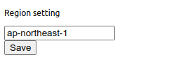
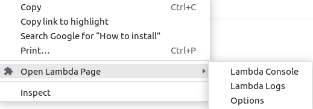
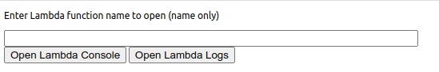

# direct-open-lambda-page

Chrome extension to open lambda console and logs page directly with the dragged section

# How to use

## Setting

- Set your region from the Options page (right click the icon).
  

## Drag function name

- On chrome browser, drag the name of the lambda function.
  - Anywhere in the chrome browser (ex. in gmail page)
  - Not ARN.
- Right click the drag section, and select Open Lambda Page -> Lambda Console or Lambda Logs
  - Lambda Console: Code page
  - Lambda Logs : Log streams page
- If the dragged string is not valid, the entrance page of Lambda and Logs will open.

## Use Clipboard

- Open Option page (from menu or from right click icon)
- Enter function name directly and select the button

# How to install

- Download direct-open/ folder.
- Go to chrome://extensions/, turn on Developer mode.
- Click Load unpacked
- Find and select the folder
- See https://support.google.com/chrome/a/answer/2714278?hl=en

# TODO

- Jump from anywhere if you are in the Lambda page
  - can use url
- Use ARN
- Save latest access
- Save favorite access
