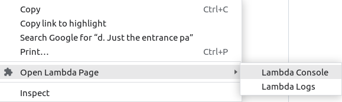

# direct-open-lambda-page
Chrome extension to open lambda console and logs page directly with the dragged section

# How to use
- Set your region from the Options page (right click the icon).
- On chrome browser, drag the name of the lambda function.
  - Anywhere in the chrome browser (ex. in gmail page)
  - Not ARN.
- Right click the drag section, and select Open Lambda Page -> Lambda Console or Lambda Logs
  - Lambda Console: Code page
  - Lambda Logs   : Log streams page
- If the dragged string is not valid, the entrance page of Lambda and Logs will open.

# How to install
- Download direct-open/ folder. (with background.js and manifest.json)
- Go to chrome://extensions/, turn on Developer mode.
- Click Load unpacked
- Find and select the folder
- See https://support.google.com/chrome/a/answer/2714278?hl=en

# TODO
- Jump from anywhere if you are in the Lambda page
  - can use url
- Use the string in the clipboard
- Use ARN
- Save latest access
- Save favorite access
