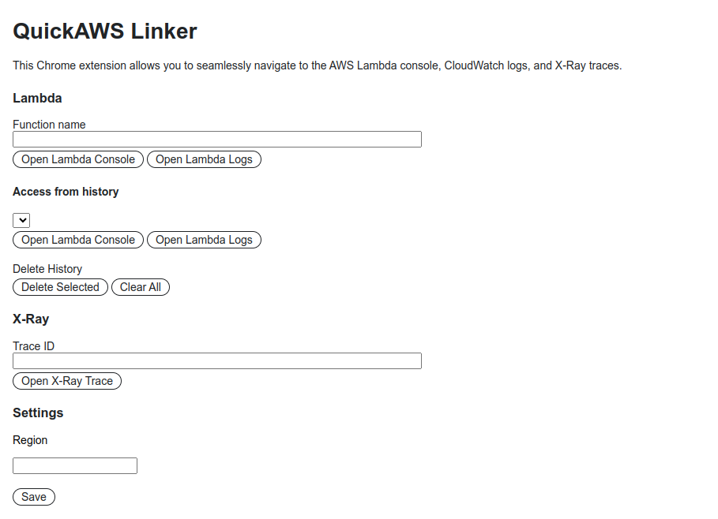
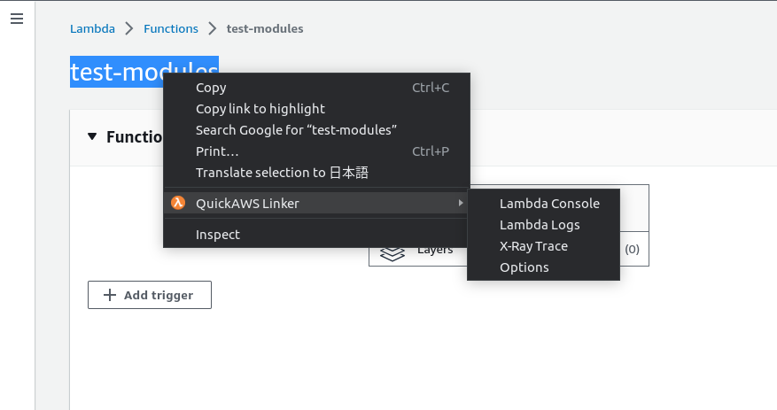

# QuickAWS Linker

QuickAWS Linker is a Chrome extension that allows users to seamlessly navigate to the AWS Lambda console, CloudWatch logs, and X-Ray traces.

## Usage Guide

### Initial Setup

#### Set AWS Region
- Upon installation, the Options page will automatically open, prompting you to set your desired AWS region.

### Usage 1: Options Page Access

1. **Access the Options Page**
   - This can be done through the browser's extension menu or by right-clicking the QuickAWS Linker icon.

2. **Enter Lambda Function Name or X-Ray Trace ID**
   - Directly enter the desired Lambda function name or X-Ray trace ID.
   - Click the corresponding button to navigate to the Lambda Console, associated logs, or X-Ray trace.

### Usage 2: Context Menu Access

1. **Select Text**
   - Highlight the Lambda function name or X-Ray trace ID anywhere in Chrome, whether in an email, webpage, or another location.

2. **Navigate with the Context Menu**
   - Right-click the highlighted text.
   - Hover over "QuickAWS Linker" in the context menu to reveal the available options.
     - **Lambda Console**: Redirects you to the code page of the selected Lambda function.
     - **Lambda Logs**: Navigates to the log streams page of the associated function.
     - **X-Ray Trace**: Opens the X-ray trace page for the selected trace ID.

---

**Note**: Always ensure that you're operating within your designated AWS region and possess the necessary permissions to access AWS services.

## How to Install the Chrome Extension in Developer Mode

1. Download the extension folder to your computer.
2. Open Google Chrome and navigate to `chrome://extensions/`.
3. Enable **Developer mode** by toggling the switch in the top right corner.
4. Click on the **Load unpacked** button.
5. Browse to the downloaded extension folder, select it, and click **Open**.
6. The extension will now be installed in Developer mode.

For more information on using Chrome extensions in Developer mode, you can visit the [Google Chrome Enterprise Help page](https://support.google.com/chrome/a/answer/2714278?hl=en).

## Contributing

Contributions to this project are warmly welcomed! Please feel free to open an issue or submit a pull request.
